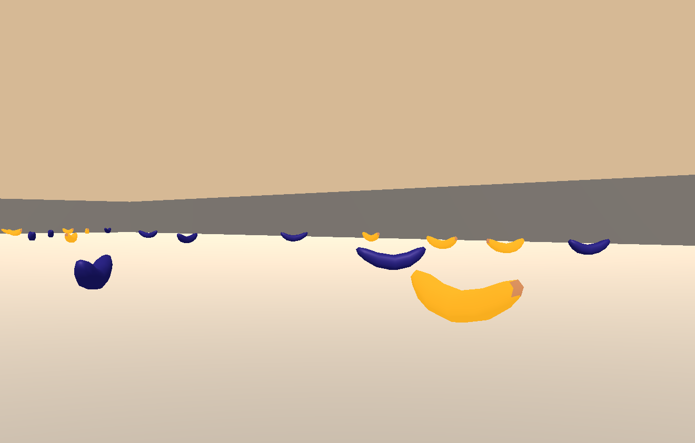

# Deep RL Nanodegree - Navigation

The goal of this project is to train an agent to navigate (and collect bananas!) in a large, square world. 

## The Environment

The environment used in this project is the Banana environment project in Unity Machine Learning Agents (ML-Agents).

A reward of +1 is provided for collecting a yellow banana, and a reward of -1 is provided for collecting a blue banana. Thus, the goal of the agent is to collect as many yellow bananas as possible while avoiding blue bananas.

The state space has 37 dimensions and contains the agent's velocity, along with ray-based perception of objects around the agent's forward direction. Given this information, the agent has to learn how to best select actions. Four discrete actions are available, corresponding to:

* 0 - move forward.
* 1 - move backward.
* 2 - turn left.
* 3 - turn right.

The task is episodic, and in order to solve the environment, the agent must get an average score of +13 over 100 consecutive episodes.

*Environment description from Deep Reinforcement Learning Nanodegree, Udacity.*

## Getting Started

### Installing dependencies

To run this project, you must have Python 3.6, Pytorch and Unity ML-Agents toolkit installed. Follow the instructions in Udacity's [Deep Reinforcement Learning Nanodegree repository](https://github.com/udacity/deep-reinforcement-learning#dependencies) to install the required dependencies.

You must also use one of the following Unity environments for this project. Download the environment specific to your platform and place it in the same folder as this project.

* [Linux](https://s3-us-west-1.amazonaws.com/udacity-drlnd/P1/Banana/Banana_Linux.zip)
* [Mac OSX](https://s3-us-west-1.amazonaws.com/udacity-drlnd/P1/Banana/Banana.app.zip)
* [Windows (32-bit)](https://s3-us-west-1.amazonaws.com/udacity-drlnd/P1/Banana/Banana_Windows_x86.zip)
* [Windows (64-bit)](https://s3-us-west-1.amazonaws.com/udacity-drlnd/P1/Banana/Banana_Windows_x86_64.zip)

### Running the code

You can run the code from any Python IDE or a terminal. 

* To run the code in a Jupyter notebook, open the ***Navigation.ipynb*** file. This notebook goes through starting the Unity environment, creating the agent, training and simulation.

* To run from a terminal, run ***nav_train.py*** to train the agent, or ***nav_sim.py*** to watch a trained agent.
<pre><code>python nav_train.py
python nav_sim.py
</code></pre>

For both the above steps, you must change the ***file_name*** variable in the code to match the appropriate platform.

## Results

After the training finishes, you can view the training results in the generated **results.png** file. You can expect the trained agent to collect the yellow bananas in the environment. Following is an example of how the agent may behave after training. Click on the image below to play a YouTube video.

