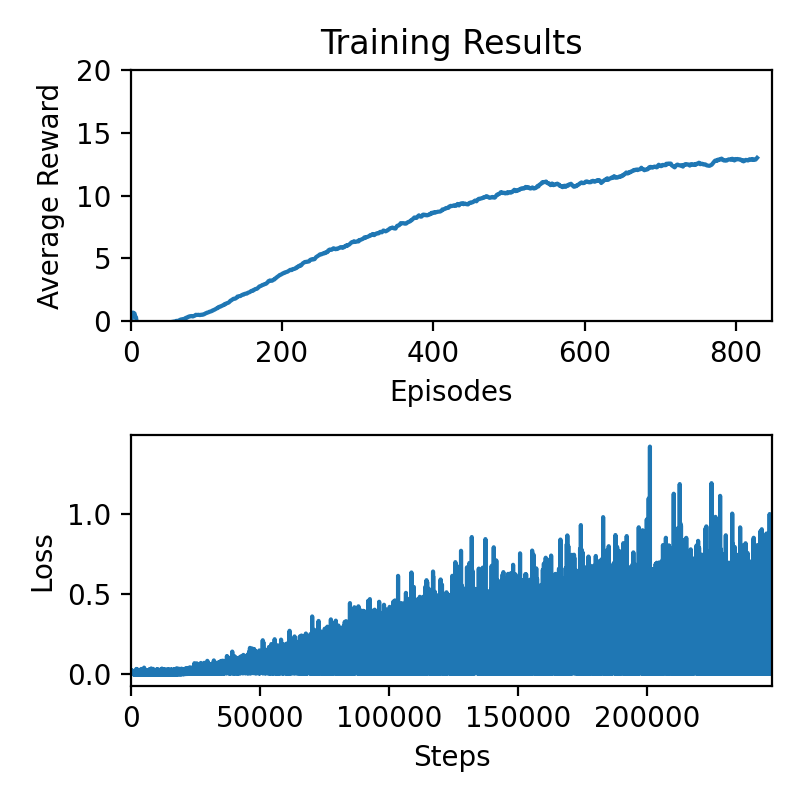

# Deep RL Nanodegree - Navigation - Report

## The Agent

A Deep Q-Network (DQN) agent combines Q-Learning with a deep neural network to learn a policy. The agent learns by interacting with the environment, receiving rewards and updating the neural network weights. 

### Experience Replay

An offline data storage buffer aka Experience Replay is used to store transitions as the agent steps through the environment. The agent samples experiences from this buffer during training and this offline sampling is known to greatly stabilize the training process.

In this implementation, the replay memory is a deque. Data is stored in the deque as (state,action,reward,next_state,done) tuples. The ***sample*** function randomly samples batches of experiences from the memory and will be used by the agent's training algorithm.

<pre><code>class ExperienceReplay:
    """Fixed-size buffer to store experience tuples."""

    def __init__(self, action_size, buffer_size, batch_size, seed):
        """Initialize a ReplayBuffer object.

        Params
        ======
            action_size (int): dimension of each action
            buffer_size (int): maximum size of buffer
            batch_size (int): size of each training batch
            seed (int): random seed
        """
        self.action_size = action_size
        self.memory = deque(maxlen=buffer_size)  
        self.batch_size = batch_size
        self.experience = namedtuple("Experience", field_names=["state", "action", "reward", "next_state", "done"])
        self.seed = random.seed(seed)
    
    def add(self, state, action, reward, next_state, done):
        """Add a new experience to memory."""
        
        e = self.experience(state, action, reward, next_state, done)
        self.memory.append(e)
    
    def sample(self,device):
        """Randomly sample a batch of experiences from memory."""
        
        experiences = random.sample(self.memory, k=self.batch_size)

        states = torch.from_numpy(np.vstack([e.state for e in experiences if e is not None])).float().to(device)
        actions = torch.from_numpy(np.vstack([e.action for e in experiences if e is not None])).long().to(device)
        rewards = torch.from_numpy(np.vstack([e.reward for e in experiences if e is not None])).float().to(device)
        next_states = torch.from_numpy(np.vstack([e.next_state for e in experiences if e is not None])).float().to(device)
        dones = torch.from_numpy(np.vstack([e.done for e in experiences if e is not None]).astype(np.uint8)).float().to(device)
  
        return (states, actions, rewards, next_states, dones)

    def __len__(self):
        """Return the current size of internal memory."""
        
        return len(self.memory)
</code></pre>

### Learning algorithm

The goal of the learning algorithm is to maximize the discounted return , where T is the time step at which the episode terminates,  is the reward at the *k-th* time step, and  is a hyperparameter that controls the importance of future rewards. The idea behind a Deep Q-Learning algorithm is to approximate the optimal state-action value function  through a deep neural network by iteratively updating the weights of the network. The update rule is governed by the Bellman equation

where a is an action sampled from the agent's policy  and  are the weights of the neural network. At every learning step, the algorithm tries to minimize the error in the Bellman equation where the optimal target value  is replaced by approximate target values  from the previous iteration step. This error is the temporal difference (TD) error and is computed using two neural networks - a target network that approximates the optimal state-action value function, and a local network that updates itself to minimize error with the target network.

The agent also uses the **Double-DQN** algorithm which decouples the action selection from the target network evaluation during computation of the TD error. This reduces issues like overestimation during training. TLDR, the argmax operation is performed on the local Q-network instead of the target network. A full description of the Double-DQN algorithm can be found in the paper [here](https://arxiv.org/abs/1509.06461).

<pre><code>def learn(self,experiences):
        """
        Learn using Double DQN algorithm.
        """
        
        # unpack experience
        states, actions, rewards, next_states, dones = experiences
        
        # get the argmax of Q(next_state)
        a_max = torch.argmax(self.Q(next_states), dim=1).cpu().data.numpy().reshape((self.minibatchsize,1))
        
        # obtain the target Q network output
        target_out = self.targetQ(next_states).detach().data.numpy()
        target_q = np.array([tout[aidx] for tout,aidx in zip(target_out,a_max)])
        
        # calculate target and local Qs
        target = rewards + self.gamma * target_q * (1-dones)
        local = self.Q(states).gather(1,actions)
        
        # calculate loss
        loss = F.mse_loss(local,target)
        
        # perform gradient descent step
        self.optimizer.zero_grad()    # reset the gradients to zero
        loss.backward()
        self.optimizer.step()
        
        # soft update target network
        for target_params, params in zip(self.targetQ.parameters(), self.Q.parameters()):
            target_params.data.copy_(self.tau*params + (1-self.tau)*target_params.data)
    
        self.loss_log.append(loss.cpu().data.numpy())
</code></pre>

### Deep Q-Network model

A simple neural network with three fully connected layers is used to model the local and target Q-networks. The network takes in the 37 observations as inputs and outputs the Q-values of all possible actions. During the forward pass, the fully connected layer outputs are passed through ReLU activation layers. A batch normalization layer is also used to wrap the outputs from the first fully connected layer, to improve training stability.

<pre><code>class QNetwork(nn.Module):
    
    def __init__(self,osize,asize,seed=0):
        
        super(QNetwork,self).__init__()
        
        self.seed = torch.manual_seed(seed)
        
        # define the deep neural network structure
        self.fc1 = nn.Linear(osize,64)
        self.fc2 = nn.Linear(64,32)
        self.fc3 = nn.Linear(32,asize)
        self.bn1 = nn.BatchNorm1d(64)
        
    
    def forward(self,x):
        
        # make forward pass through the network
        x = self.bn1(F.relu(self.fc1(x)))
        x = F.relu(self.fc2(x))
        x = self.fc3(x)
        return x
</code></pre>

### Hyperparameters

* The DQN algorithm relies on the ***epsilon*** hyperparameter for exploration. For this project, the ***epsilon*** parameter is initially set to 0.95 at the begininng of training when the policy favors random actions. At each agent step, the epsilon value is decayed exponentially by a decay factor of 1e-5, with a minimum epsilon limit of 0.1. With this exponential decay, the agent favors exploration towards the beginning of training and exploitation later on.
* The agent learns from mini batches of 64 experiences. For the gradient computation, the adam optimizer is used with a learn rate of 2e-4.
* A discount factor of 0.99 favors long term rewards during return computation.
* The target Q-network is soft-updated with an update factor of 1e-3. This reduces sudden changes in the target network and improves training stability.

<pre><code>BUFFERSIZE = int(1e6)    # Experience buffer size
GAMMA = 0.99             # Discount factor
EPSILON = 0.95           # Epsilon parameter for exploration
DECAY = 1e-5             # Epsilon decay rate
EPMIN = 0.1              # Minimum value of epsilon
MINIBATCHSIZE = 64       # Batch size for sampling from experience replay
LEARNRATE = 2e-4         # Learn rate of Q network
TAU = 1e-3               # Target network update factor
</code></pre>

## Training results

With the above hyperparameter set and network structure, the agent solves the environment in 828 episodes. Following is a plot of the training progress with average reward per episode and mean squared loss of the TD error per agent step.

## Future work

One future direction for this project is to implement a Prioritized Experience Replay (PER). A PER stores experience priorities in addition to experiences. The priorities play a role during sampling from the PER, ensuring that valuable experiences are sampled more often than others.
